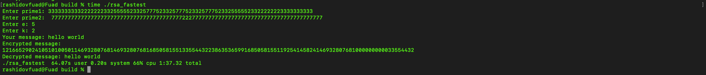

## RSA Encryption/Decryption Program
-This program implements RSA encryption and decryption in C++. It allows users to input two prime numbers and an exponent, encrypt a message, and then decrypt it back to its original form. The program uses a custom LargeNumber class to handle large integers.

## Features

- Input two prime numbers.
- Input public exponent and a coefficient.
- Encrypt a plaintext message using RSA encryption.
- Decrypt the encrypted message back to plaintext

## Requirements

- A C++ compiler (e.g., g++, clang++).
- A working implementation of the `LargeNumber` class for handling large integers.

## Example1

- Enter prime1: 61
- Enter prime2: 53
- Enter e: 17
- Enter k: 1
- Your message: Hello
- Encrypted message: 
- 234213167
- 654314150
- ...
- Decrypted message: Hello

## Example2

-

